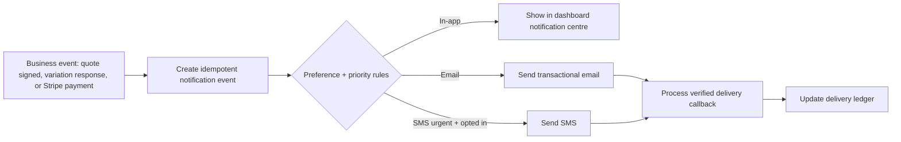
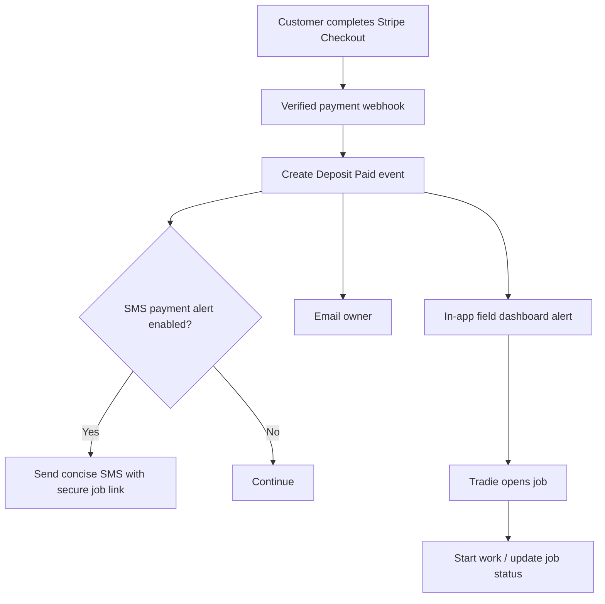
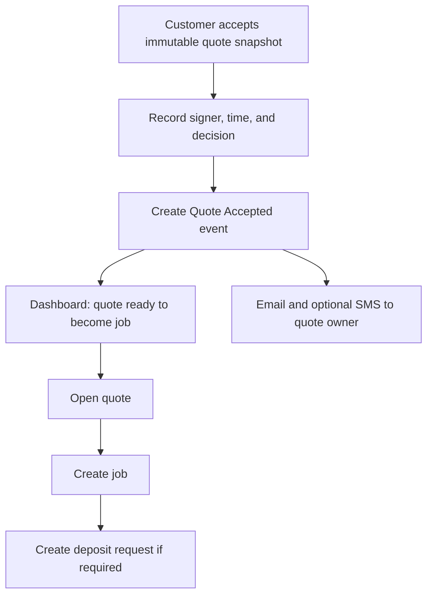
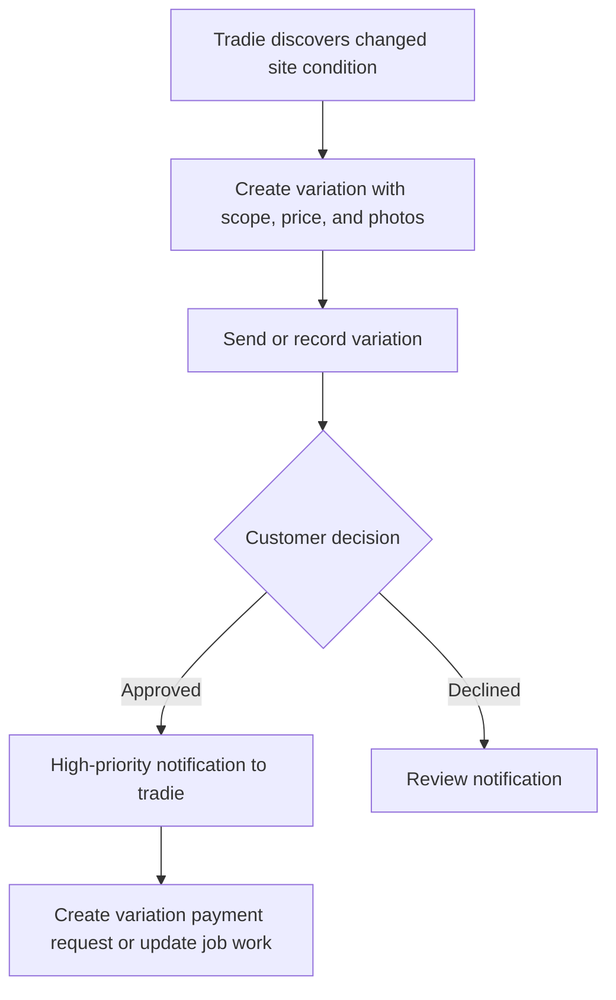

# TradieQuote: Field Dashboard and Notification Specification

**Document status:** Product and implementation specification.  
**Scope:** Field-first mobile dashboard, in-app alerts, email notifications, and optional SMS escalation for Australian trade businesses.

## 1. Product intent

TradieQuote should help an owner-operator answer three questions in a few seconds while standing at a job site: **What needs my attention? What work is moving? What money is at risk or ready to collect?** The dashboard should not reproduce the full desktop workspace. It should surface the next worthwhile action and take the user directly to it.

Notifications should be **event-led, concise, and actionable**. A tradie should be alerted immediately when a customer has accepted a quote, approved or declined a variation, or completed a deposit/invoice checkout. Follow-up reminders should be configurable and lower priority, rather than becoming another noisy inbox.

## 2. Mobile dashboard design

The delivered `/dashboard` view is a single-column field dashboard. It uses the existing trade-ledger visual language: a forest-green action panel, paper-like cards, high-contrast job counts, and short operational copy. It is intentionally sized for one-handed use on a phone while remaining usable on a larger screen.

| Dashboard block | Primary question | Source | Action |
|---|---|---|---|
| **Field dashboard header** | What is the quickest productive action? | User action | Start a new quote |
| **On the tools** | How many jobs are active? | Jobs with `active` status | Open Jobs |
| **Follow up** | Which quotes need movement? | Quotes in `ready` or `sent` status | Open Quotes |
| **Money in motion** | What value is currently being delivered? | Sum of active-job quoted values | Open payment and variation controls |
| **Next actions** | Which jobs should I touch now? | Active jobs first, then planned jobs | Open Jobs |
| **Quote desk / Price book** | Where can I price or reuse standard rates? | Quote and price-book workspaces | Open destination workspace |

The first release intentionally avoids invented urgency scores or fabricated activity. As dates, assigned team members, customer messages, and payment data become available, the **Next actions** block can develop into a ranked queue with explicit reasons such as “deposit overdue”, “customer accepted 8 minutes ago”, or “variation awaiting customer response”.

### Mobile interaction rules

The dashboard should retain a minimum 44px touch target for primary actions and retain the bottom area for future persistent navigation. Tapping a metric must take the tradie to the relevant workspace, not a dead-end summary. Count cards are short, but their labels explain what they count. Monetary figures use AUD formatting and distinguish job value from cash actually paid.

## 3. Notification trigger matrix

The initial system should send **in-app notifications** for every relevant event. Email should cover all meaningful business events. SMS should be reserved for time-sensitive or high-value events and must be opt-in at the business level.

| Event | Default recipient | In-app | Email | SMS | Primary CTA | Priority |
|---|---|---:|---:|---:|---|---|
| Customer accepts quote | Quote owner | Yes | Yes | Yes | Open quote / create job | High |
| Customer declines quote | Quote owner | Yes | Yes | No | Open quote and revise | Medium |
| Variation marked sent | Quote owner | Yes | No | No | View variation | Low |
| Variation approved | Quote owner | Yes | Yes | Yes | Open job / create payment request | High |
| Variation declined | Quote owner | Yes | Yes | No | Review variation | Medium |
| Deposit payment completed | Quote owner | Yes | Yes | Yes | Open job / start work | Critical |
| Invoice payment completed | Quote owner | Yes | Yes | Yes | Open job / mark complete | Critical |
| Payment checkout abandoned or unavailable | Quote owner | Yes | Yes | No | Reissue payment request | Medium |
| Quote awaiting action | Quote owner | Yes | Optional digest | No by default | Send reminder / revise quote | Low |
| Payment due soon or overdue | Quote owner | Yes | Yes | Optional, opt-in | Open payment request | High |

The emails should have a descriptive subject such as **“Deposit paid — Kitchen mixer replacement”** and a single primary button. SMS should contain no sensitive scope, address, payment, or personal data beyond the job reference and a secured application link. An example is: “TradieQuote: Deposit received for Kitchen mixer replacement. Open job: [secure link].”

## 4. Delivery choices and recommendation

The three viable approaches below can be enabled progressively. The first is intentionally lighter-weight; the second is the recommended operating model for a professional tradie platform.

| Approach | Trade-offs | Cost | Setup complexity |
|---|---|---|---|
| **In-app alerts only** | Fastest and private, but a tradie may not see it while working in another app. | No external messaging supplier. | Low |
| **In-app + transactional email, with SMS only for high-priority events** **(recommended)** | Strong balance of visibility, cost control, and low notification fatigue. Requires an email supplier and SMS supplier configuration. | External provider usage charges apply. | Medium |
| **SMS and email for every event** | High reach but becomes noisy, can increase costs, and risks being ignored. | Highest provider usage. | Medium |

The recommended route is event-driven rather than polling. Quote acceptances and variation decisions create notification intents when they are recorded. Stripe events should be handled by the existing verified webhook endpoint, which is the authoritative trigger for a completed checkout. For provider delivery telemetry, both SMS and email systems should handle duplicate or out-of-order callbacks: Twilio documents asynchronous outbound status callbacks, and Resend documents at-least-once, unordered webhook delivery.[1] [2]

Scheduled notifications should be limited to configurable, deterministic reminders such as a daily **“Quotes to follow up”** digest or payment-due reminders. They must use the platform-managed scheduled callback mechanism, be idempotent, and never depend on an in-process timer.

## 5. Notification preferences and safety controls

Each tradie account should own a notification-preferences record. A global default is used until the tradie changes it. The product should support email, SMS, and in-app channels independently per event category.

| Setting | Default | Behaviour |
|---|---|---|
| Business email alerts | Enabled | Receives all high and critical events. |
| Business SMS alerts | Disabled | Can be enabled for accepted quotes, approved variations, and paid requests. |
| Quiet hours | 8:00 pm–7:00 am local time | High/critical events are queued until the next permitted time; no silent bypass in the first release. |
| Daily follow-up digest | Enabled at 7:30 am local time | Summarises quotes awaiting action and due/overdue requests. |
| Payment amount threshold | Optional | Sends SMS only when a paid deposit/invoice meets or exceeds a user-selected threshold. |
| Failed delivery fallback | Enabled | On a permanent SMS failure, send email and display an in-app alert. |

The preferences screen must make the business owner’s responsibility clear: a notification is a helpful alert, not proof that a customer received or read a legal document. The quote-acceptance audit record remains the product’s business record; delivery state merely aids follow-up.

## 6. Core data model and processing rules

The future implementation should add `notificationPreferences`, `notificationEvents`, and `notificationDeliveries` records. The event row contains the business event type, owner, related quote/job/variation/payment request, a generated action link, and a stable idempotency key. The delivery row records the selected channel, provider message identifier, delivery state, sent time, and provider callback timestamp.

No raw card details, payment secrets, full webhook payloads, or customer data beyond what the notification requires should be stored in the notification ledger. Provider callback handlers should verify signatures, process by provider delivery identifier exactly once, and use provider timestamps rather than arrival time when a sequence matters. Resend explicitly identifies `svix-id` as an event-delivery identifier for deduplication and notes that delivery order is not guaranteed.[2]

## 7. Field-user flows

### 7.1 Deposit paid while the tradie is on site

### 7.2 Quote acceptance follow-up

### 7.3 On-site variation

## 8. Acceptance criteria and implementation order

The first implementation release is complete when the dashboard reads only real account data; an in-app notification card has a working deep link; an accepted quote and paid Stripe checkout each create a notification event exactly once; owner email alerts are sent; and the owner can disable optional SMS alerts. Payment and customer records remain scoped to the authenticated trade business.

The proposed rollout is to first ship the mobile dashboard with in-app notification centre and deep links. Second, add event-triggered email for customer acceptance, approved variations, and paid checkout events. Third, add opt-in Twilio SMS for high/critical events and verified delivery callbacks. Fourth, introduce daily digest and due-date reminders through the managed scheduled callback system.

## References

[1] [Twilio, “Track the Message Status of Outbound Messages”](https://www.twilio.com/docs/messaging/guides/track-outbound-message-status)  
[2] [Resend, “Managing Webhooks”](https://resend.com/docs/webhooks/introduction)
