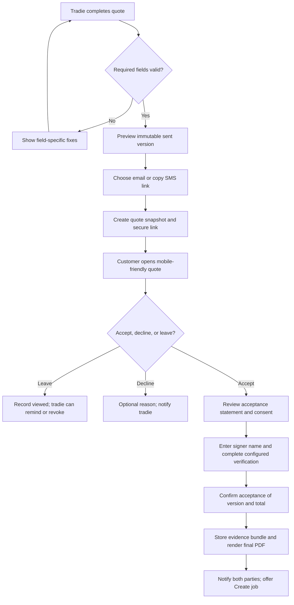
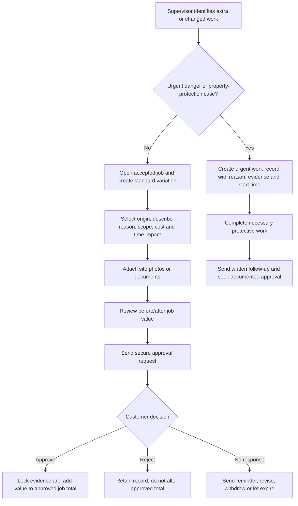

# TradieQuote AI — Priority Feature PRD and User Flows

**Product:** TradieQuote AI  
**Document owner:** Manus AI  
**Version:** 1.0  
**Date:** 27 August 2026  
**Status:** Product specification for design, engineering, and legal review

## 1. Executive summary

TradieQuote AI already makes it faster for Australian tradies to create, revise, save, and present a professional quote. The next product objective is to make the quote the trusted starting point for the commercial work that follows. This PRD specifies three tightly connected capabilities: **customer e-signature**, a reusable **price book**, and **variation management**.

Together, these capabilities convert a quote from a static estimate into an auditable job commitment. A tradie should be able to build a consistent price from their own catalogue, send a customer a clear acceptance page, and document any scope or price change before additional non-urgent work begins. The product must remain clear that the tradie is responsible for confirming the scope, price, licensing, tax treatment, and the applicable law in their jurisdiction.

> **Product principle:** TradieQuote must make the right commercial action the easiest action: price from a current source, ask for a clear approval, and preserve the evidence without adding office work.

| Priority | Capability | Primary business outcome | Release decision |
|---|---|---|---|
| P0 | E-signature | Improve quote-to-job conversion and create a durable acceptance record | Ship first |
| P0 | Price book | Reduce time to create a consistent, profitable quote | Ship first, behind account-level access |
| P0 | Variations | Reduce uncontrolled scope creep and disputed extras | Ship after acceptance data model is stable |

## 2. Context and product opportunity

### 2.1 Problem statement

Small trade businesses commonly move between site, van, phone, and office. They need to prepare a quote quickly but also need a reliable record of what was agreed, what price basis was used, and what changed once work was underway. A generic document editor does not preserve enough context. An accounting package often begins too late, at invoicing. A construction-management product can be excessive for a sole trader or small crew.

TradieQuote should solve this narrow but high-frequency operating problem. It should allow an owner-operator, estimator, or office manager to generate a customer-ready quote, apply their approved rates, collect a deliberate acceptance, and raise a transparent variation from the accepted job. Each transaction should retain its own immutable commercial snapshot rather than changing retrospectively when rates or templates are updated.

### 2.2 Target users and jobs to be done

| Persona | Context | Core job to be done | Current failure mode |
|---|---|---|---|
| Owner-operator tradie | Quoting between site visits and active jobs | “Help me get a clear yes without spending my evening rewriting quotes.” | Quotes are slow, follow-up is informal, approval evidence is scattered. |
| Estimator or office manager | Produces multiple quotes and supports a field team | “Help me use the business’s latest price and terms consistently.” | Rates live in spreadsheets or memory, creating margin and consistency risk. |
| Trade supervisor | Discovers additional work at site | “Help me explain and obtain approval for an extra before my crew proceeds.” | Extra work is discussed verbally and later disputed. |
| Customer | Receives a proposed scope and price on mobile | “Help me understand exactly what I am accepting and respond without friction.” | PDF attachments are hard to review, and approval instructions are unclear. |

### 2.3 Goals and non-goals

The first release must create a credible acceptance record, make a tradie-owned price book useful during quoting, and make a variation legible as a change against an accepted baseline. It must be fast on mobile, accessible, auditable, and conservative about legal claims.

The initial release is **not** a full contract-lifecycle management platform, a complete accounting ledger, a supplier procurement system, or a substitute for legal advice. It will not make universal assertions about the legal sufficiency of a particular signature method or variation process. State and territory contracts, licensing, consumer, and building requirements can differ; product copy and configuration must reflect this uncertainty.

## 3. Product foundations shared by all three features

### 3.1 Terminology and state model

| Term | Definition |
|---|---|
| Quote version | An immutable revision of a quote as it appeared when sent, viewed, accepted, declined, expired, or superseded. |
| Acceptance | A customer’s recorded action approving a specific sent quote version. It is not a generic approval of future changes. |
| Price book item | A reusable, tradie-owned service, material, call-out, equipment, or allowance definition with price and tax defaults. |
| Price snapshot | The item description, cost, sell rate, tax setting, and mark-up copied into a particular quote or variation at the time of use. |
| Accepted baseline | The accepted quote version plus any previously approved variation versions. It is the comparison point for a new variation. |
| Variation | A proposed, documented change to approved work, price, programme, or both. |
| Evidence bundle | The event log, parties, timestamps, documents, relevant metadata, signatory statement, and tamper-evident hashes attached to a quote acceptance or variation approval. |

The quote state model shall distinguish commercial readiness from customer action. A quote transitions from `draft` to `ready`, then `sent`, `viewed`, `accepted`, `declined`, `expired`, or `superseded`. A variation transitions from `draft` to `sent`, `viewed`, `approved`, `rejected`, `expired`, `cancelled`, or `recorded-after-urgent-work`. Transitions must be append-only events; the UI can show the current state but must not erase earlier events.

### 3.2 Australian operating guardrails

The electronic-signature feature must provide a deliberate acceptance process, not merely place an image of a signature on a document. The Attorney-General’s Department explains that the method should identify the signer, indicate their intention to approve the communication, and be as reliable as appropriate in the circumstances; consent to electronic signing may also be relevant in private dealings. [1]

For NSW residential building work, the government states that variations must be in writing, attached to the contract, and signed by the parties or their nominated representatives. It also notes that the variation should describe the work, cost impact, calculation, and any extra time, with a limited urgency pathway where safety or property damage is at risk. [2] This is a strong product pattern, but it must be implemented as a configurable jurisdictional policy rather than treated as one rule for every Australian job.

The default GST rate in the existing estimate is 10%, reflecting the current general Australian GST rate. [3] Customer-ready estimates must be labelled **Quote** or **Variation**, not **Tax Invoice**, unless a separate invoicing product and its requirements have been implemented. [4]

> **Required legal and compliance review:** Before general availability, obtain Australian legal review of customer terms, signatory language, data retention, each initial jurisdictional workflow, deposit/payment wording, and any regulated trade or domestic-building scenarios.

### 3.3 Shared functional requirements

| ID | Requirement | Priority | Acceptance criterion |
|---|---|---|---|
| SH-01 | Version all customer-visible commercial documents. | P0 | Editing a sent or accepted quote/variation creates a new draft or revision; the original rendered document remains retrievable. |
| SH-02 | Store an append-only event trail. | P0 | Each send, view, reminder, approval action, decline, expiry, document render, and status change records actor, timestamp, entity ID, and event payload. |
| SH-03 | Use secure, revocable share links. | P0 | A public recipient link uses a high-entropy token, expires as configured, can be revoked, and never exposes another customer’s document. |
| SH-04 | Preserve the commercial snapshot. | P0 | Later edits to the price book, customer record, business profile, or template do not alter a sent, accepted, or approved document. |
| SH-05 | Support mobile-first review. | P0 | A customer can read the scope, line items, GST, total, terms, and approve/decline controls at 360px width without horizontal page scrolling. |
| SH-06 | Provide accessible controls and documents. | P0 | Core flows meet WCAG 2.2 AA expectations for keyboard access, focus state, error text, labels, contrast, and non-colour status cues. |
| SH-07 | Apply privacy-by-design. | P0 | The design records data flows, limits role access, uses secure storage, and defines retention/deletion rules before release. The OAIC recommends embedding privacy in design and using an early, evolving privacy impact assessment. [5] |

## 4. Feature A — Customer e-signature and quote acceptance

### 4.1 Product objective

Enable a customer to securely review and accept one precise quote version from a phone or desktop. The tradie receives immediate notification and retains a complete evidence bundle that can be exported with the accepted quote.

### 4.2 Scope

The first release covers quote presentation, deliberate acceptance, typed full name, explicit consent/intent, optional drawn signature, optional one-time-code verification, acknowledgement receipt, evidence capture, event history, expiry, decline, resend, and revocation. The final output is an accepted-quote PDF containing the quote snapshot, acceptance statement, signing events, and a document fingerprint.

Deposits are a **separate, optional workflow** that starts after acceptance. The e-signature release must expose a payment hand-off interface but must not process card or bank credentials itself. A future payment integration may request a deposit as a configurable amount, percentage, or milestone; this requires separate payment-provider, refund, and customer-terms requirements.

### 4.3 User stories

| ID | User story | Priority |
|---|---|---|
| ES-01 | As a tradie, I want to preview the exact version I am sending so I know the customer sees an accurate scope and total. | P0 |
| ES-02 | As a tradie, I want to send a secure link by email and copy it to SMS so the customer can respond from their preferred device. | P0 |
| ES-03 | As a customer, I want to see the full scope, cost schedule, assumptions, exclusions, terms, GST, and validity date before I accept. | P0 |
| ES-04 | As a customer, I want a clear declaration of what I am accepting and a copy of the final document. | P0 |
| ES-05 | As a tradie, I want proof of which quote version was accepted, by whom, and when. | P0 |
| ES-06 | As a tradie, I want to revoke or supersede an outstanding quote link if the scope or price changes. | P0 |
| ES-07 | As an office manager, I want to resend an expiring or unseen quote without recreating it. | P1 |
| ES-08 | As a customer, I want to propose a question or decline with a reason without accidentally accepting. | P1 |

### 4.4 Detailed functional requirements

#### A. Send and recipient experience

The quote editor shall have a `Send for acceptance` action available only when mandatory business, customer, commercial, and document fields pass validation. Before send, the user sees a compact confirmation panel showing recipient details, quote amount, validity date, delivery channel, and the current quote version number. Sending creates an immutable quote snapshot and a recipient link.

The recipient page shall use a calm, mobile-first layout and show the tradie’s business identity, quote number, scope, line-item schedule, subtotals, GST, total, validity date, assumptions, exclusions, terms, and attachments. Important financial and contractual information must not be hidden behind an accordion by default. A customer can download the pre-acceptance PDF or request a copy by email.

The customer must actively select `Accept quote` to enter the signing step. The signing step must state that the customer is approving the identified quote version, show the total including GST, and require a checkbox confirming consent to use an electronic signature method. The customer then enters their full legal name or authorised representative name. A drawn signature is optional for the P0 experience but can be enabled by the tradie or jurisdictional policy. The final confirm button must be labelled with a specific action such as `Accept quote for $2,640.00`.

#### B. Evidence and audit record

On confirmation, the system shall capture the quote version ID; rendered-document SHA-256 hash; requested recipient email/phone; entered signer name; consent and acceptance statement version; method used; timestamps; user-agent; source IP address or privacy-reviewed equivalent; link/token ID; and any verification event. The system shall render and store an immutable final PDF and deliver a copy to the recipient and tradie.

The product shall not claim that this evidence is legally conclusive. In-app wording should say that the system has recorded the customer’s acceptance of the displayed quote, and recommend that the business use terms and process appropriate to its work and jurisdiction.

#### C. Security and controls

Recipient links must use a cryptographically random, single-purpose token. The token record stores only a salted hash where feasible. Links are valid for a configurable duration, defaulting to the quote validity date. A previously issued link becomes unavailable if the quote is revoked, superseded, accepted, declined, or expired. The server must rate-limit link access, acceptance attempts, and verification attempts.

Email address plus one-time verification code should be the preferred P1 default for higher-value or jurisdictionally sensitive documents. In P0, the product must support a policy setting that requires a one-time verification code before final acceptance. The UI must make the authentication strength visible to the tradie in the evidence panel.

#### D. Status, notifications, and exceptions

The tradie sees current status in the quote workspace. `Viewed` is an observed event and should never be presented as a guarantee that the recipient read the document. `Accepted` triggers an immediate in-app and email notification, locks the commercial snapshot, and offers `Create job` or `Request deposit` where configured. `Declined` captures an optional customer reason. `Expired` does not delete the document; the tradie can create a new revision and send that revision.

### 4.5 E-signature state transitions

| Current state | Action | Next state | System behaviour |
|---|---|---|---|
| Draft | Mark ready | Ready | Validate required content and retain editable status. |
| Ready | Send | Sent | Freeze version, create recipient link, issue delivery event. |
| Sent | Recipient opens | Viewed | Record first and subsequent view events. |
| Sent or Viewed | Customer accepts | Accepted | Confirm evidence, render final PDF, revoke active link, notify parties. |
| Sent or Viewed | Customer declines | Declined | Store optional reason, notify tradie, retain document. |
| Sent or Viewed | Validity passes | Expired | Block acceptance; show tradie contact path. |
| Sent or Viewed | Tradie revises/revokes | Superseded or Revoked | Remove recipient action; link shows an explanatory state. |

### 4.6 E-signature acceptance criteria

| ID | Testable acceptance criterion |
|---|---|
| ES-AC-01 | The system cannot send a quote without customer name, business name, scope, at least one priced item, terms, GST presentation, total, and a validity date. |
| ES-AC-02 | Sending creates a versioned, uneditable snapshot that remains available after the editable draft changes. |
| ES-AC-03 | The public page displays the exact snapshot total and all material conditions before the acceptance control. |
| ES-AC-04 | Acceptance requires an explicit consent control, signer name, and a final confirmation naming the quote total. |
| ES-AC-05 | The evidence bundle contains document hash, signer data, version IDs, event timestamps, acceptance-statement version, and configured verification events. |
| ES-AC-06 | The accepted PDF is available to the customer and tradie, and the active acceptance link cannot be used again. |
| ES-AC-07 | Revoked, superseded, expired, and declined links never present an active acceptance control. |

### 4.7 E-signature user flow



## 5. Feature B — Tradie-owned price book

### 5.1 Product objective

Enable a tradie to price repeatable work consistently using their own services, materials, mark-up, tax setting, labour rates, and templates. The price book should make the fast path more profitable and should never rewrite historical documents.

### 5.2 Scope

The P0 price book contains individual items and reusable assemblies. An individual item is a priced service, material, equipment allowance, call-out, or other cost. An assembly is a reusable bundle of line items and scope text, such as `Replace standard electric hot-water unit` or `Split-system service call`.

P0 supports create, edit, archive, search, filter, apply to quote, bulk import/export using CSV, item-level permissions, and price snapshots. P1 adds multiple price books by branch, supplier catalogue mapping, scheduled supplier price refresh, margin guardrails, and quote profitability reporting.

### 5.3 Pricing model

| Field | Description | P0 behaviour |
|---|---|---|
| Item name and description | Customer-facing wording, with internal notes kept separate. | Required name; description optional but recommended. |
| Item type | Labour, material, call-out, equipment, subcontractor, allowance, or other. | Required. |
| Default unit | Hour, each, metre, m², day, item, or custom. | Required. |
| Cost rate | Internal estimated cost per unit. | Optional in the initial customer-facing quote product; restricted by permission. |
| Sell rate | Default sell price per unit before or after mark-up, per account policy. | Required for an active item. |
| Mark-up rule | Fixed percentage, target margin, or no automatic mark-up. | Fixed percentage P0; target margin P1. |
| Tax setting | Taxable, GST-free, or custom/needs review. | Default taxable with account-level configurable default. |
| Trade, category, tags | Search and filter keys. | Required trade/category; tags optional. |
| Supplier/source | Optional supplier, SKU, URL, and last-reviewed date. | Source fields P0; integrations P1. |
| Status | Draft, active, archived. | Archived items remain visible in historic snapshots but are not selectable for new quotes. |

To eliminate ambiguity, the account must choose one `pricing display policy`: either **sell rate entered directly** or **cost plus mark-up**. The selected policy controls the editor labels and formula. The price book stores both the numerical inputs and calculated sell rate where applicable. A quote line always stores the final chosen sell rate and mark-up as a snapshot, regardless of the book’s later state.

### 5.4 User stories

| ID | User story | Priority |
|---|---|---|
| PB-01 | As a tradie, I want to save my common call-out, labour, material, and equipment items once and use them in future quotes. | P0 |
| PB-02 | As an estimator, I want to search by trade and keyword while building a quote. | P0 |
| PB-03 | As a business owner, I want historical quotes to retain their original price even if I update the price book tomorrow. | P0 |
| PB-04 | As a manager, I want to import an existing spreadsheet rather than retype hundreds of items. | P0 |
| PB-05 | As a manager, I want to stop obsolete items being added to new quotes without removing their history. | P0 |
| PB-06 | As an estimator, I want a reusable job template that adds scope, conditions, and several cost lines together. | P0 |
| PB-07 | As an owner, I want a warning if a quote line has a lower margin than my configured minimum. | P1 |

### 5.5 Detailed functional requirements

#### A. Price book workspace

The price-book workspace shall include a searchable table, item count, trade/category filters, status filter, last-updated information, and a clear action to add an item or import CSV. It shall support an inline quick edit for sell rate, mark-up, status, and review date, plus a full detail screen for descriptions, internal notes, supplier source, and history.

The system shall enforce permission levels. The account owner and designated `price-book manager` can create, edit, import, archive, and export. An `estimator` can apply items and, depending on a configurable policy, override price in a quote. A `field user` can search/apply approved items but cannot see cost or edit master prices unless granted access.

#### B. Quote composer integration

From any quote line item, the user can choose `Add from price book`. A side panel provides search, category filters, recent items, and assemblies. Selecting an individual item adds a line using the current price-book values. Selecting an assembly shows its components and any included scope/conditions before adding them. The user can adjust quantity, description, sell rate, and mark-up in the quote according to their role. Any adjustment affects only the quote snapshot unless the user explicitly chooses `Update price book item` and has permission.

When a book item is applied, the quote stores `priceBookItemId`, `priceBookVersionId`, snapshot name, description, unit, cost if permitted, sell rate, mark-up, tax code, and source information. If the master item is archived or edited, the quote must continue to show the stored snapshot. The UI may display a non-blocking `Price has changed since this quote` indicator only while the quote remains editable.

#### C. CSV import and data quality

CSV import shall begin with downloadable templates for items and assemblies. Upload performs column mapping, row-level validation, duplicate detection, calculated-price preview, and error export. Import cannot silently overwrite an existing active item. The user must choose `create new`, `update matching external reference`, or `skip` for each detected conflict. Imported rows receive an audit entry identifying the importing user and source file hash.

### 5.6 Price book acceptance criteria

| ID | Testable acceptance criterion |
|---|---|
| PB-AC-01 | A manager can create, edit, search, archive, and export an item with the required pricing fields. |
| PB-AC-02 | An estimator can add an individual item or assembly to a quote in no more than three interactions after opening the picker. |
| PB-AC-03 | Applying an item stores a price snapshot; later master-price edits do not alter the quote line. |
| PB-AC-04 | An archived item cannot be selected for a new quote but remains visible in historical price references. |
| PB-AC-05 | CSV import identifies invalid rows and conflicts before writes occur, and gives the user a row-level resolution. |
| PB-AC-06 | Cost-rate visibility and master-price editing follow the account role policy. |

### 5.7 Price book user flow

```mermaid
flowchart TD
    A[Manager opens Price book] --> B{Create manually or import?}
    B -- Create --> C[Enter item type, unit, price and tax defaults]
    B -- Import --> D[Upload CSV and map columns]
    D --> E[Preview validation, duplicates and calculated values]
    E --> F{Resolve errors/conflicts}
    F --> G[Publish active items]
    C --> G
    G --> H[Estimator opens a quote]
    H --> I[Search item or assembly]
    I --> J[Review quantity and applied snapshot]
    J --> K[Add editable cost line(s) to quote]
    K --> L[Send quote stores commercial snapshot]
    L --> M[Future master-price changes do not modify sent quote]
```

## 6. Feature C — Variation management

### 6.1 Product objective

Enable a tradie to record an out-of-scope change, calculate its price and time effect, request customer approval, and preserve the relationship between the variation and the accepted baseline. The experience should make scope changes easy to explain and difficult to lose.

### 6.2 Scope

The P0 release supports variations against an accepted quote/job, supporting photos and documents, detailed line items, price and schedule impact, before/after totals, customer presentation, approval using the shared acceptance engine, rejection, cancellation, and an urgent-work exception record. It shall not allow a variation to alter the original accepted quote.

P1 includes multi-party approvals, subcontractor quotes, partial variations, staged allowances, integration with timesheets, and invoice schedule creation. Contract-specific policy templates and jurisdictional rules are separate P1/P2 work following legal review.

### 6.3 Variation classification and data

| Field | Requirement | Purpose |
|---|---|---|
| Variation number | Sequential, job-scoped identifier, such as `VAR-0003`. | Creates clear customer and staff references. |
| Origin | Customer request, unforeseen condition, compliance/safety issue, design change, allowance reconciliation, or other. | Enables reporting and customer explanation. |
| Reason and scope | Plain-language change description plus detailed work scope. | Explains why the original quote no longer applies. |
| Supporting evidence | Photos, annotated images, supplier documents, or site notes. | Supports visibility and later resolution. |
| Cost schedule | Labour, materials, equipment, subcontractor, and other lines; uses price-book snapshots where available. | Shows how the figure was derived. |
| Financial impact | Variation subtotal, GST, total, current approved job total, and revised approved total. | Makes the consequence unambiguous. |
| Programme impact | Additional calendar days/hours or revised completion date, plus explanation. | Records time consequence beside the price consequence. |
| Urgency | Standard or urgent safety/property-protection record. | Controls pre-approval checks. |
| Approval statement | Configurable wording, versioned at send. | Creates a deliberate customer decision. |

### 6.4 User stories

| ID | User story | Priority |
|---|---|---|
| VM-01 | As a supervisor, I want to create a variation from the job while on site and attach photos of the discovered condition. | P0 |
| VM-02 | As a tradie, I want the variation to show the original approved total, approved changes to date, and the revised total. | P0 |
| VM-03 | As a customer, I want to understand the change, why it is needed, what it costs, and whether it changes timing before I approve. | P0 |
| VM-04 | As a tradie, I want an approved variation to update the job’s approved value without altering the original quote. | P0 |
| VM-05 | As a supervisor, I want an urgent safety/property-protection pathway that documents why prior written approval was impracticable. | P0 |
| VM-06 | As an office manager, I want to see pending, ageing, approved, and rejected variations across jobs. | P1 |
| VM-07 | As a business owner, I want reporting on variation value and reasons to find recurring estimating gaps. | P1 |

### 6.5 Detailed functional requirements

#### A. Creating a variation

The action `New variation` is available only from a job with an accepted quote baseline. The opening step requires selecting an origin and standard/urgent pathway. The standard pathway requires a summary, work scope, at least one impact—price or time—and an explanatory customer-facing reason. The variation editor reuses the quote line-item and price-book picker. It defaults to the job’s GST and terms policy but allows authorised edits. It displays a live financial summary comprising original accepted value, previously approved variation value, current approved contract value, proposed variation value, and revised value.

The editor must encourage, but not fabricate, calculation detail. Where all line items are populated, the price breakdown is presented to the customer. A tradie may record a lump-sum variation only when they provide a written calculation/rationale note. Product analytics should distinguish calculated and lump-sum changes.

#### B. Customer review and approval

The customer variation page reuses the secure-link and signature evidence framework. It must visually distinguish the original approved work from the proposed change. Above the approval control it must show the reason, scope, supporting evidence, price impact inclusive of GST, time impact, and new approved total. It must state whether work will commence only after approval or explain the urgent-work record.

Approval requires the same consent, identification, and confirmation pattern as quote acceptance. The button must use a meaningful label, for example `Approve variation for $480.00`. Approval appends the approved variation value to the job total, locks the variation version, and notifies the job team. Rejection does not delete the record or alter the approved total.

#### C. Urgent work exception record

The urgent pathway exists for cases where delaying work presents a documented risk to people or property. It is not a shortcut around normal approval. The user must select a reason, supply a minimum narrative, attach at least one photo or document where practical, record the time work began, identify who authorised the immediate action if applicable, and send the written record to the customer as soon as practicable. The UI shall label this `Urgent work record — approval follow-up required`, not `Approved variation`.

The default policy should disable urgent variations for non-supervisory roles and should provide a configuration setting for organisation/jurisdiction. The product must retain the pre- and post-work sequence clearly in the event log.

#### D. Variation visibility and controls

The job page shall show a variation register sorted by date and status, a current approved job value, pending variation value, and a count of aged pending requests. Each variation page shall include the previous approved baseline and a chronological event history. A new variation must not be sent if another variation is in an unresolved conflict state that changes the same work package, unless the user explicitly confirms the relationship.

### 6.6 Variation state transitions

| Current state | Action | Next state | System behaviour |
|---|---|---|---|
| Draft | Send for approval | Sent | Freeze variation version, generate secure link, notify customer. |
| Sent | Customer opens | Viewed | Record view; retain pending value separately from approved value. |
| Sent or Viewed | Customer approves | Approved | Lock snapshot, update approved job value, notify team. |
| Sent or Viewed | Customer rejects | Rejected | Record reason if given; preserve baseline without price change. |
| Sent or Viewed | Tradie withdraws | Cancelled | Block approval and retain audit record. |
| Sent or Viewed | Expiry passes | Expired | Block approval; require a new revision to proceed. |
| Draft | Log urgent work | Recorded-after-urgent-work | Capture mandatory urgency record; send follow-up approval record. |

### 6.7 Variation acceptance criteria

| ID | Testable acceptance criterion |
|---|---|
| VM-AC-01 | A variation cannot be created without an accepted job/quote baseline. |
| VM-AC-02 | The variation document displays the original approved value, prior approved variations, proposed impact, GST, time impact, and revised value. |
| VM-AC-03 | The original accepted quote remains immutable after a variation is drafted, approved, rejected, or cancelled. |
| VM-AC-04 | Approval uses the shared secure acceptance flow and creates an immutable evidence bundle and final PDF. |
| VM-AC-05 | Only an approved variation changes the job’s approved total; pending and rejected variations remain separate. |
| VM-AC-06 | An urgent record requires the configured explanation, timing, and evidence fields and is visibly distinct from a standard approved variation. |
| VM-AC-07 | The variation register shows current state, amount, origin, date, approval history, and link to the exact document version. |

### 6.8 Variation user flow



## 7. Cross-feature user journey

The intended end-to-end journey is deliberately short. A tradie creates or updates an item once in the price book, uses it when quoting, gets a customer to accept the exact quote version, converts the accepted quote into a job, and then raises a variation only when the approved baseline needs to change. The customer should always be able to identify the latest document, its value, its status, and what action is required.

| Step | Tradie action | Customer experience | System record |
|---|---|---|---|
| 1. Set standards | Creates services, materials, rates, mark-up and templates. | No customer action. | Price-book versions and audit events. |
| 2. Build quote | Adds price-book items; adjusts job-specific quantities or rates. | No customer action. | Editable quote and price snapshots. |
| 3. Send and accept | Sends final quote version with a secure link. | Reviews and deliberately accepts/declines. | Quote snapshot, delivery/view/acceptance events, evidence PDF. |
| 4. Perform job | Uses accepted scope as the baseline. | Sees that work has been approved. | Job created from accepted version. |
| 5. Change work | Raises detailed variation from the accepted baseline. | Reviews reason, impact, and revised total; approves/rejects. | Variation snapshot and evidence; approved total changes only after approval. |

## 8. Data model and system interfaces

### 8.1 Core entities

| Entity | Key fields | Notes |
|---|---|---|
| `quote_versions` | quote ID, version number, rendered payload, document hash, state, sent/expiry timestamps | Stores immutable customer-visible quote content. |
| `acceptance_requests` | entity type, entity version ID, token hash, recipient, delivery method, expiry, revoked timestamp | Supports a single secure-link mechanism for quotes and variations. |
| `acceptance_events` | request ID, event type, actor/signatory information, evidence payload, timestamp | Append-only event trail. |
| `signature_evidence` | acceptance event ID, method, typed name, signature asset hash, consent-statement version, verification status | Kept separate so sensitive signature details can be access-controlled. |
| `price_book_items` | owner/account ID, type, item text, unit, cost, sell rate, mark-up, tax code, status | Mutable master data with version history. |
| `price_book_versions` | price-book item ID, changed fields, actor, timestamp | Provides source traceability. |
| `price_book_assemblies` | name, scope template, condition templates, item components, status | Reusable multi-line quote patterns. |
| `jobs` | accepted quote version ID, approved baseline amount, operational status | Created on acceptance; owns variation register. |
| `variations` | job ID, variation number, origin, urgency, current state, financial/time impact | Mutable working record with versioned public documents. |
| `variation_versions` | variation ID, document payload, document hash, state, approval details | Immutable customer-visible variation snapshot. |

### 8.2 Server/API requirements

All state-changing operations require authenticated account access except recipient link actions. Recipient endpoints must resolve by token only and apply short-lived, scoped session state after initial access. Sensitive payloads must never be returned through broad list endpoints.

| Domain | Example command | Expected response |
|---|---|---|
| Price book | `createPriceBookItem`, `importPriceBookCsv`, `applyAssemblyToQuote` | Versioned item/assembly and validation feedback. |
| Quote acceptance | `prepareQuoteVersion`, `sendAcceptanceRequest`, `revokeAcceptanceRequest` | Snapshot/version ID, delivery result, and link status. |
| Recipient signing | `getRecipientDocument`, `beginAcceptance`, `confirmAcceptance` | Safe document projection, verification state, final receipt. |
| Variations | `createVariation`, `sendVariationApproval`, `recordUrgentWork`, `approveVariation` | Variation version, job financial summary, audit event. |

### 8.3 Integrations and dependencies

| Dependency | Required by | Decision needed |
|---|---|---|
| Transactional email service | Quote and variation delivery, receipts, reminders | Select provider, domain configuration, templates, bounce handling. |
| SMS service | Optional share and reminder channel | Confirm sender ID, consent and communication policy. |
| PDF rendering service | Immutable customer document and acceptance certificate | Confirm reliable server-side renderer and document storage. |
| Object storage | Photo/document evidence and final PDFs | Enforce account/user ownership and retention policy. |
| Payment provider | Optional post-acceptance deposit request | Separate PRD; do not build into e-signature P0. |
| Legal/compliance review | Acceptance wording and variation policy templates | Required before general availability. |

## 9. Non-functional requirements

### 9.1 Security, privacy, and retention

Quote links, signer metadata, customer contact details, addresses, job-site photos, and final documents are sensitive business and personal information. The product must use encryption in transit, access-controlled storage, least-privilege role checks, audit events for sensitive actions, signed or token-gated media access, and robust session controls. Link tokens must not appear in analytics, email-preview crawlers, logs, referer headers where avoidable, or user-visible error telemetry.

The product team must complete a privacy impact assessment and maintain a data-flow map covering capture, AI processing, storage, sharing, sub-processors, retention, and deletion. This reflects the OAIC guidance that privacy risks are best considered early and throughout a changing project. [5] The exact retention period must be an account policy informed by legal review; deletion must be designed to preserve required evidence or clearly document any retained audit record.

### 9.2 Reliability and performance

The recipient document page should reach usable content within 2.5 seconds at p75 on a standard Australian 4G connection, excluding customer-side email/SMS delivery time. Quote and variation send operations must be idempotent. Acceptance confirmation must use server-side locking so a link cannot create two approved events when tapped twice or opened in multiple tabs. PDF rendering may be asynchronous but must show an unambiguous processing state and retry mechanism.

### 9.3 Observability and analytics

The event model should produce privacy-reviewed analytics without recording document contents. Required metrics include quote send rate, first-view rate, acceptance rate, time-to-accept, resend rate, link-expiry rate, price-book item usage, overrides from book price, variation rate per job, variation approval rate, variation turnaround time, and variation value by origin. Events must distinguish user action from system automation and never treat a view as acceptance.

## 10. Success metrics

| Metric | Baseline | 90-day target after release | Guardrail |
|---|---|---|---|
| Median time to build repeat quote | Establish during beta | Reduce by 30% for accounts using price book | No increase in average rate overrides without explanation. |
| Quote acceptance conversion | Establish during beta | Improve by 10 percentage points for sent digital quotes | No material increase in post-acceptance disputes. |
| Time from variation creation to decision | Establish during beta | Less than 24 hours median for customer-viewed variations | Track rejected and expired rates separately. |
| Jobs with an approved commercial baseline | Establish during beta | At least 80% of jobs created from an accepted quote | Do not count draft or viewed quotes as approved. |
| Price-book adoption | Establish during beta | At least 60% of active quoting accounts apply an item in 30 days | Track active, not merely imported, items. |

## 11. Rollout plan

### Phase 1 — Foundation and closed beta

Implement quote versioning, secure link infrastructure, PDF snapshots, evidence-event framework, basic price-book items, role permissions, and the privacy impact assessment. Invite a small group of varied trades—at least plumbing, electrical, and building—to test with non-critical jobs. Do not market the electronic signature process as universally legally binding; use legally reviewed, appropriately limited product language.

### Phase 2 — E-signature and price-book general release

Release send, view, typed-name acceptance, configurable verification, receipt PDF, price book, assemblies, CSV import, history, and revision/revocation. Monitor delivery, acceptance, and support signals. Add a support tool to resolve a customer who cannot access a link without exposing document data.

### Phase 3 — Variations beta and then general release

Release the standard variation path first. Gate urgent-work records to selected beta customers and roles. Validate the job-value calculations, document clarity, and customer decision flow before adding reminders, reporting, or payment collection.

## 12. Risks and mitigations

| Risk | Impact | Mitigation |
|---|---|---|
| Overstating legal effectiveness of a signature workflow | Customer harm and compliance risk | Legal review; careful product copy; configurable assurance; evidence capture rather than legal promises. |
| State/territory and contract variation rules differ | Incorrect user guidance | Jurisdiction-aware policy framework; no universal legal assertion; launch limited configurations after review. |
| Staff bypass variation approvals under time pressure | Scope and collection disputes | Make standard variation fast on mobile; retain a stricter urgent record; surface pending variation value prominently. |
| Price book becomes stale | Margin loss and user distrust | Last-reviewed metadata, archive process, change indicator, and later supplier-price integrations. |
| Secure link forwarded to the wrong person | Unauthorised document access | Expiry/revocation, verification policies, minimal PII on access screen, token logging controls, and high-value signing settings. |
| AI-generated scope is treated as verified advice | Safety and commercial errors | Preserve human review step; require tradie confirmation before send; display scope/price responsibility notice. |

## 13. Open questions for product and legal review

| Area | Decision required |
|---|---|
| Signer assurance | Which jobs, values, trades, or jurisdictions require email/SMS one-time-code verification or additional signer evidence? |
| Multi-party approval | Must spouse/co-owner, strata manager, builder, or project manager approval be supported in the first variation release? |
| Deposit flow | Will payment requests be offered after acceptance, what providers are approved, and what refund/cancellation language is required? |
| Account structure | Do teams need branches, separate trading entities, multiple licence numbers, or configurable brand profiles at launch? |
| Variation policy | Which initial states and contract categories will receive reviewed templates, and what language should show for unconfigured jurisdictions? |
| Price display | Should price book defaults be sell-price first, cost-plus-mark-up, or selectable per account? |
| Record retention | What retention policy applies to accepted quotes, audit evidence, job photos, signatures, and deleted accounts? |

## 14. References

[1] [Attorney-General’s Department, *Electronic signatures*](https://www.ag.gov.au/legal-system/electronic-signatures-documents-and-transactions/electronic-signatures)  
[2] [NSW Government, *Contracts for residential building work*](https://www.nsw.gov.au/housing-and-construction/building-or-renovating-a-home/preparing/contracts)  
[3] [Australian Taxation Office, *How Australian GST works*](https://www.ato.gov.au/businesses-and-organisations/international-tax-for-business/gst-for-non-resident-businesses/how-australian-gst-works)  
[4] [Australian Taxation Office, *Tax invoices*](https://www.ato.gov.au/businesses-and-organisations/gst-excise-and-indirect-taxes/gst/tax-invoices)  
[5] [Office of the Australian Information Commissioner, *Privacy by design*](https://www.oaic.gov.au/privacy/privacy-guidance-for-organisations-and-government-agencies/privacy-impact-assessments/privacy-by-design)
